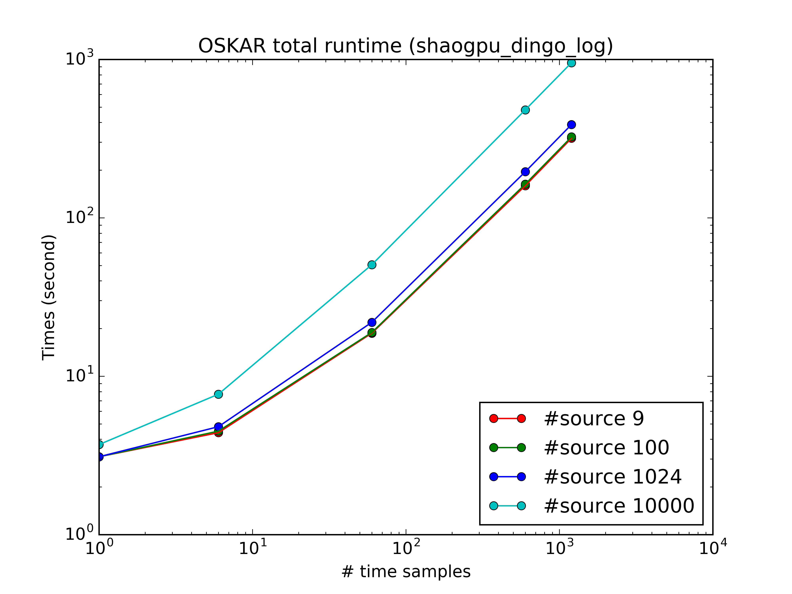
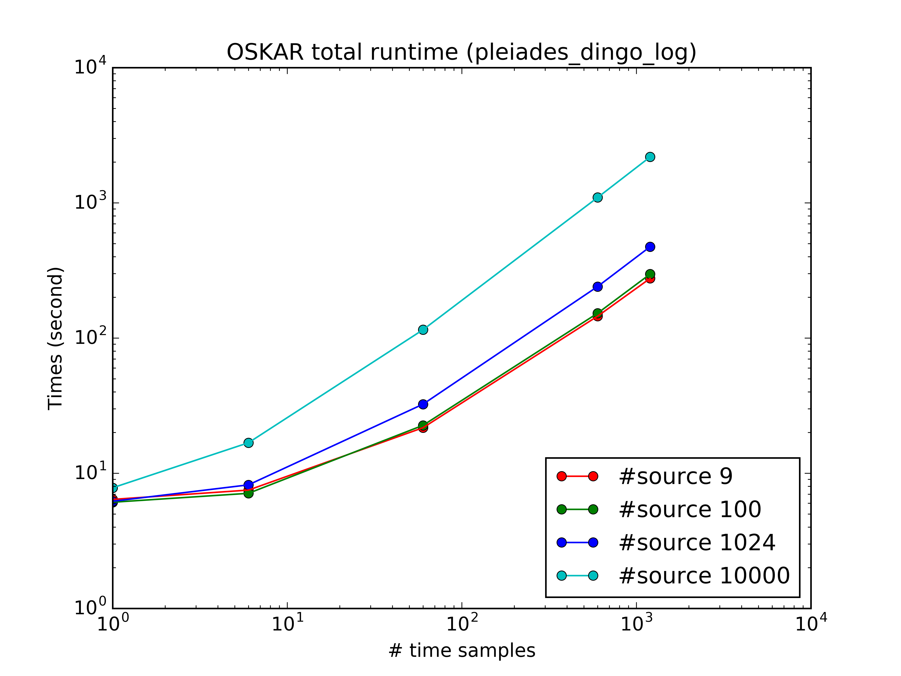
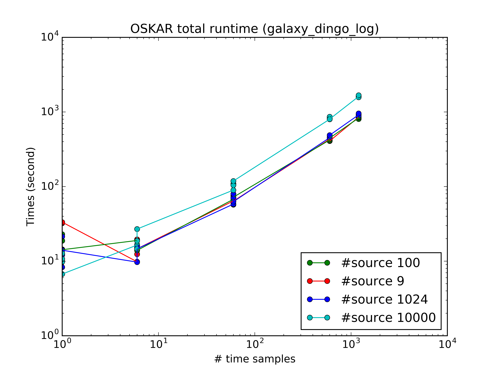
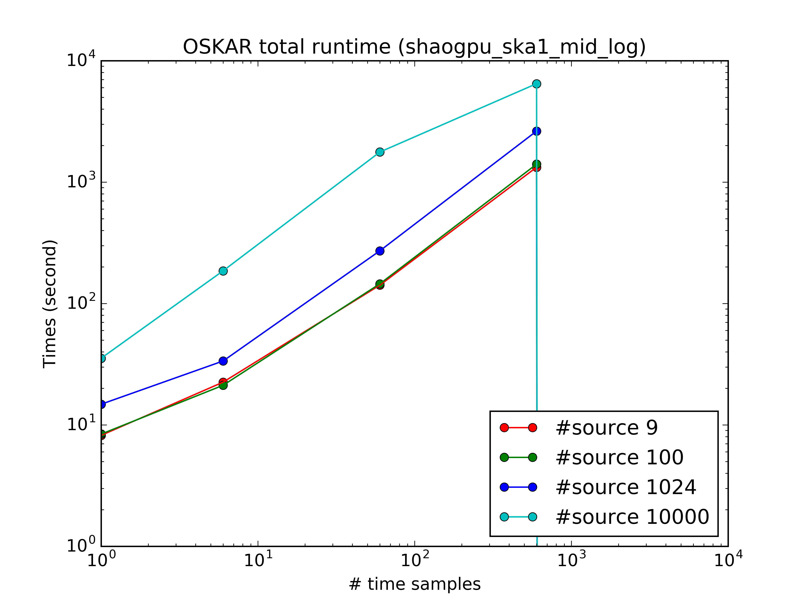
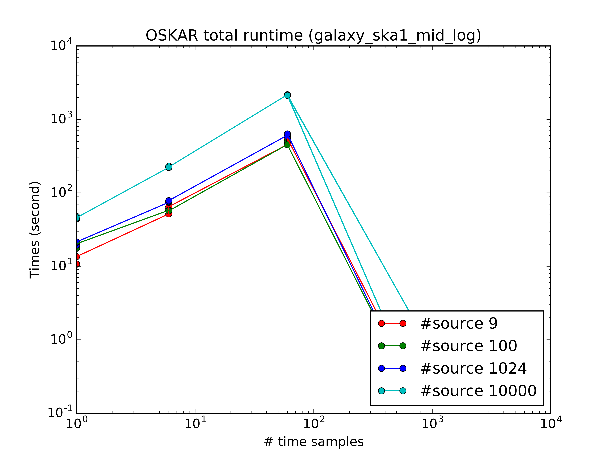

# OSKAR 2.6.1 Scaling Test

[TOC]

A series of scaling simulation tests had been run on 
Galaxy at Pawsey, Pleiades at ICRAR(International Centre for  Radio Astronomy Research) 
and GPU server at SHAO(Shanghai Astronomical Observatory).

We recorded all the information including runtime, computation time,total recorded file size, etc.
Here we had used the SKA1-MID configuration of 254 antenna/stations and DINGO configuration of 36 antennas.

The choose of number of sources, time samples  refer to 
[Scaling test for SKA1 MID simulations](https://confluence.ska-sdp.org/display/SS/Scaling+tests+for+SKA1+MID+simulations).

We selected 300 MHz bandwidth, 100 channels, starting at 1 GHz.
Each station beam was modelled as a Gaussian with FWHM 0.8179 degrees at the observation frequency of 1.4 GHz, the same as the previous reference.

## DINGO setting

| # Source| # Time samples   	| SHAO-GPU | Pleiades  | Galaxy |
|  --     |------ 				|-------   | ---       |-----   |
| 9       | 1					| 3.1	   |  6.4      | ~32    |
| 9       | 6					| 4.4      |  7.5      | ~14.6  |
| 9       | 60					| 18.7     |  21.7     | ~65    |
| 9 	  | 600					| 159.5    |  145.0    | ~420   |
| 9 	  | 1200				| 317.6    |  276.0    | ~830   |
| 100     | 1					| 3.1	   |  6.1      | ~14.5  |
| 100     | 6					| 4.5      |  7.1      | ~15.0  |
| 100     | 60					| 18.9     |  22.6     | ~70    |
| 100 	  | 600					| 163.3    |  152.5    | ~420   |
| 100 	  | 1200				| 324.2    |  297.1    | ~820   |
| 1024    | 1					| 3.1	   |  6.2      | ~15    |
| 1024    | 6					| 4.8      |  8.2      | ~15    |
| 1024    | 60					| 21.9     |  32.4     | ~70    |
| 1024 	  | 600					| 195.4    |  240.2    | ~470   |
| 1024 	  | 1200				| 387.9    |  473.5    | ~900   |
| 10000   | 1					| 3.7	   |  7.8      | ~10    |
| 10000   | 6					| 7.7      |  16.8     | ~18    |
| 10000   | 60					| 480.4    |  115.1    | ~108   |
| 10000   | 600					| 159.5    |  1094.4   | ~827   |
| 10000   | 1200				| 953.2    |  2184.7   | ~1600  |

## SKA1-MID setting

| # Source| # Time samples   	| SHAO-GPU  | Pleiades  | Galaxy |
|  --     |------ 				|-------    | ---       |-----   |
| 9       | 1					| 8.2	    |  TBC      | ~10.7    |
| 9       | 6					| 22.5      |  TBC      | ~60  |
| 9       | 60					| 141.6     |  TBC      | ~500    |
| 9 	  | 600					| 1325.8    |  TBC      | TBC   |
| 9 	  | 1200				| TBC       |  TBC      | TBC   |
| 100     | 1					| 8.4	    |  TBC      | ~20  |
| 100     | 6					| 21.2      |  TBC      | ~56  |
| 100     | 60					| 145.3     |  TBC      | ~460    |
| 100 	  | 600					| 1405.1    |  TBC      | TBC |
| 100 	  | 1200				| TBC       |  TBC      | TBC   |
| 1024    | 1					| 14.8	    |  TBC      | ~20    |
| 1024    | 6					| 33.6      |  TBC      | ~75    |
| 1024    | 60					| 271.6     |  TBC      | ~580    |
| 1024 	  | 600					| 2632.1    |  TBC      | TBC|
| 1024 	  | 1200				| TBC       |  TBC      | TBC   |
| 10000   | 1					| 35.4	    |  TBC      | ~45    |
| 10000   | 6					| 185.8     |  TBC      | ~220    |
| 10000   | 60					| 1768.5    |  TBC      | ~2100   |
| 10000   | 600					| 6468.2    |  TBC      | TBC|
| 10000   | 1200				| TBC       |  TBC      | TBC|

## Hardware Details
All these test are based GPU in the following hardwares :

- Galaxy Supercomputer
  - 4 GPU node test
- Pleiades Supercomputer
  - Pleiades (on the loging node)
    - One GeForce GTX 480
  - Pleiades01
    - Two Tesla C2070 *don't work when running in single node*  
  - Pleiades02
    - One Tesla C2070 *don't work when running in single node*  
- A single GPU server
  - One Tesla K40M 

## Software Details

Here we use OSKAR 2.6.1 which have an approximate 40% improvement in the write performance than previous version.
Detail refer [OSKAR-Release-Notes](http://www.oerc.ox.ac.uk/~ska/oskar/OSKAR-Release-Notes.pdf)

When compiling source code, the compiler version as follows:

| Platform | gcc   | cmake    | CUDA  |
|  --      |------ |-------   | ---   |
| Galaxy   | 4.8.2 | 2.8.12.2 | 5.5.51|
| Pleiades | 4.7.3 | 2.8.12.2 | 6.5   |
| SHAO-GPU | 4.8.5 | 2.8.11   | 7.5   |

# Next Step

- Do the full scale SKA1 simulatioin
- Check the simulation data (which should need an astronomer)
- Compare the simulatioin data with CASA
